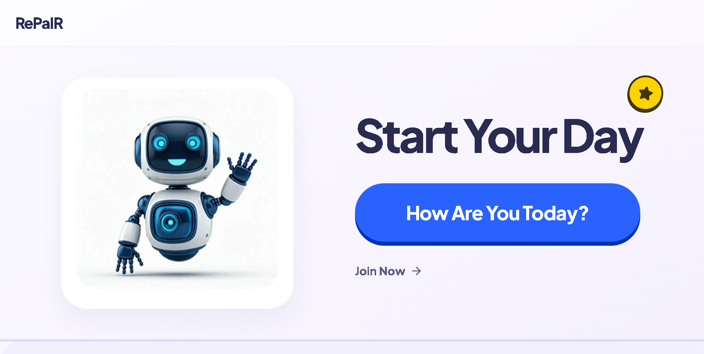
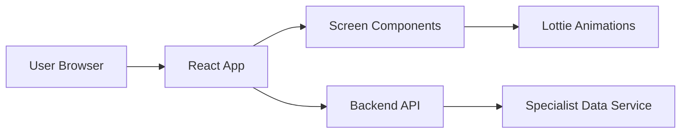

# RePair
A compassionate companion app for children that combines expressive UI and inclusive learning support.

---

## Project Overview
RePair is an inclusive companion application engineered to bridge learning gaps for children. It is designed so technology adapts to diverse learning needs, delivering personalized guidance and actionable clarity for both users and specialists.

This project supports children, caregivers, educators, and specialists who need an intuitive interface for mood tracking, expressive interaction, and guided learning support.

RePair solves the problem of one-size-fits-all learning tools by offering a playful, accessible UI and a modular front-end experience that connects to specialist-focused backend services.

---

## Table of Contents
- [Features](#features)
- [Tech Stack](#tech-stack)
- [Project Structure](#project-structure)
- [Getting Started](#getting-started)
  - [Prerequisites](#prerequisites)
  - [Installation](#installation)
- [Environment Variables](#environment-variables)
- [Running the Project](#running-the-project)
- [Screenshots](#screenshots)
- [Demo](#demo)
- [Deployment](#deployment)
- [Usage](#usage)
- [Architecture](#architecture)
- [Security](#security)
- [Performance Optimizations](#performance-optimizations)
- [Testing](#testing)
- [Roadmap](#roadmap)
- [Contributing](#contributing)
- [License](#license)
- [Author](#author)
- [Acknowledgements](#acknowledgements)

---

## Features
- Multimodal emotional companion interface
- Mood selection and expressive feedback
- Guided learning and play interaction
- Animated Lottie illustrations for engagement
- Smooth motion and interaction design
- Mobile-friendly responsive layout
- Specialist-ready state tracking pattern
- Easy deployment with Vite and Vercel

---

## Tech Stack
### Frontend
- React
- Vite
- TypeScript
- Tailwind CSS
- HTML

### UI / Animation
- Lottie React
- Motion
- Lucide Icons

### Tools
- Git
- GitHub
- VS Code
- dotenv

---

## Project Structure
```
.
+-- design images/
+-- lotte files/
+-- src/
�   +-- App.tsx
�   +-- main.tsx
�   +-- index.css
�   +-- components/
�       +-- CaptureScreen.tsx
�       +-- HistoryScreen.tsx
�       +-- JoinNowScreen.tsx
�       +-- MoodScreen.tsx
�       +-- MultimodalScreen.tsx
�       +-- TalkScreen.tsx
+-- .env.example
+-- index.html
+-- package.json
+-- package-lock.json
+-- tsconfig.json
+-- vite.config.ts
+-- README.md
```
- `src/` � main application source files and component definitions.
- `src/components/` � screen components for the companion interface.
- `lotte files/` � local Lottie animation assets used by the app.
- `design images/` � design reference assets and concept files.
- `.env.example` � sample environment variables.
- `vite.config.ts` � Vite configuration.

---

## Getting Started
### Prerequisites
### important
 npm , node and git should be installed in your system before running running these below commands
 
- Node.js 20+ or compatible LTS version
- npm 10+ or latest stable npm
- Git


---

### Installation
```bash
git clone https://github.com/RePaIR-ORG/RePair-UI.git
cd RePair-UI
npm install
```

---

## Environment Variables
| Variable | Description |
| --- | --- |
| `GEMINI_API_KEY` | API key for Gemini AI calls if backend integration requires AI services |
| `APP_URL` | Application runtime URL or self-referential callback URL |

> Never expose secret values in public repositories.

---

## Running the Project
### Development
```bash
npm run dev
```

---

For backend , see: https://github.com/RePaIR-ORG/RePair-Backend

---

## Screenshots



---

## Demo
- Live Demo: https://special-kid-ui.vercel.app
- Backend Repo Github Link: https://github.com/RePaIR-ORG/RePair-Backend
- Specicalist UI Live Demo : https://repair-specialist.vercel.app/
- Specicalist UI Github Link : https://github.com/RePaIR-ORG/Specialist-UI
---

## Deployment
This project is deployable on Vercel. The app is built as a static React front-end with Vite.

Deploy steps:
1. Connect the repository to Vercel.
2. Set environment variables in Vercel dashboard.
3. Use the default build command: `npm run build`.
4. Use the output directory: `dist`.

---

## Usage
Users interact with RePair through a friendly onboarding flow:
- Select a mood or guided activity
- Explore the companion interface
- Choose from Talk, Capture, and Mood experiences
- View progress and guided options for specialist review

The app is intended to support inclusive learning and to surface actionable interaction patterns.

## Architecture
### Frontend Flow


### API Communication
- Front-end sends requests to the backend service
- Backend handles user state, AI guidance, and specialist workflows
- This repository focuses on the client-facing experience

---

## Security
- Environment variables are managed via `.env` or Vercel secrets
- No secret values are stored in source control
- Front-end assets and dependencies are served securely by Vercel
- Backend API security is handled by the separate RePair backend repository

---

## Performance Optimizations
- Vite development server for fast local builds
- Tailwind CSS for lightweight styling
- Lottie animation assets are used as compact JSON files
- Production build minimizes and bundles application code

---


---

## Roadmap
- [ ] Integrate frontend with RePair backend API
- [ ] Add specialist dashboard views and data summaries
- [ ] Improve accessibility and keyboard navigation
- [ ] Add onboarding analytics and progress reports
- [ ] Expand mobile experience and responsive polish

---

## Contributing
1. Fork the repository.
2. Create a feature branch: `git checkout -b feature/name`
3. Commit your changes: `git commit -m "Add feature"`
4. Push to your branch: `git push origin feature/name`
5. Open a Pull Request.

---

## License
No license is specified for this repository yet. Add a valid open-source license to clarify usage terms.

---

## Author
- Name: RePair Project Team
- GitHub: https://github.com/RePaIR-ORG
- Email: [ repair email ]

---

## Acknowledgements
- React
- Vite
- Tailwind CSS
- Lottie React
- motion/react
- Lucide Icons
- Gemini AI integration pattern

---

## Badges
[](https://github.com/RePaIR-ORG/RePair-UI)
[](https://github.com/RePaIR-ORG/RePair-UI)
[](https://github.com/RePaIR-ORG/RePair-UI)
[](https://special-kid-ui.vercel.app)
